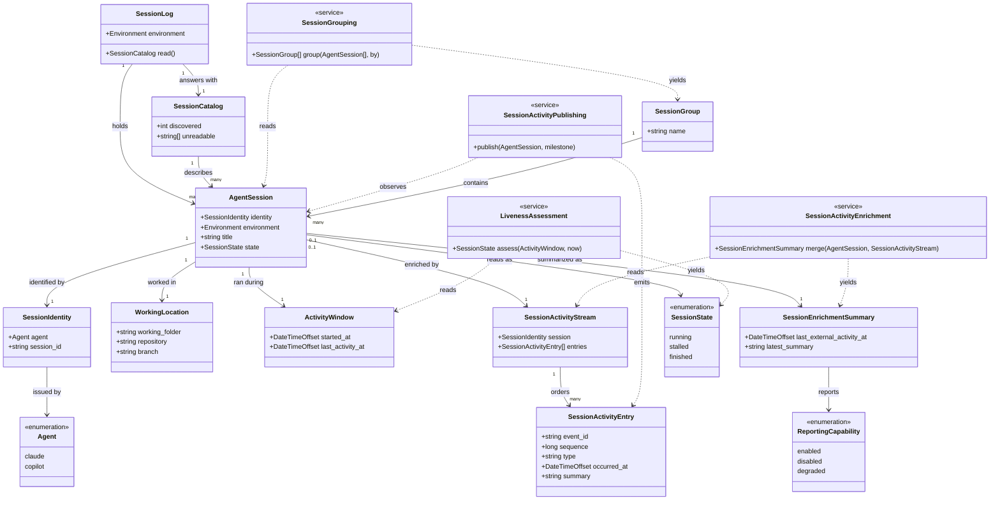

# Domain Model: Sessions

```meta
status: active
related: [.domain/sessions/domain.md]
```

> Structural view of the domain model for this bounded context: aggregates,
> entities, value objects, and their relationships. Keep this in sync with
> `domain.md` (which describes responsibilities/invariants in prose) — this file
> focuses on structure and relationships. Lifecycle flows live in `flow.md`.

## Model diagram



## Relationship notes

- **`Session Log` is scoped to one `Environment`, not to a fleet.** The environment
  is the only thing that can read its own agents' records, so a log spanning several
  would assert facts nobody gathered. A multi-environment view is a composition of
  several logs, which is why "group by environment" is a derivation on the diagram's
  right-hand side rather than a containment edge on its left.

- **`Agent Session` is an entity, not a value object**, even though nothing in this
  context ever changes one. It has identity — `Session Identity` — and two readings
  of the same session are the same session with a later `Activity Window`, which is
  exactly what identity means. Value equality would make a session that had moved on
  a different session.

- **`Session State` is an attribute of a reading, not stored on the session.** The
  dashed edges from `Liveness Assessment` say so: the service reads an
  `Activity Window` and a clock and yields a state. Nothing persists it and nothing
  transitions into it, which is why `flow.md` shows the states as a reading and not
  as a machine with events on its edges.

- **`Session Catalog` points at the same `AgentSession` instances the log holds**, and
  additionally carries what could not be read and how many were discovered. It is the
  shape of an *answer*, not a second collection: `discovered` may exceed the number of
  sessions it describes, and that difference is the whole reason it exists.

- **`Session Activity Stream` is optional and subordinate to the local record.** A
  session without the stream is still a complete session, because local evidence is
  what proves the session exists. The stream only enriches a known session with
  externally reported milestones.

- **`Session Identity` is a pair on purpose.** Nothing in the diagram relates an
  `AgentSession` to a bare `session_id`, because a session id is only unique within
  the agent that issued it; the `Agent` enum hangs off the identity rather than off
  the session for the same reason.

- **`Session Activity Entry` separates identity from order.** `event_id` is what
  collapses duplicates; `sequence` is what lets late arrivals still read in the order
  the session meant. One without the other would either duplicate or mis-order the
  same activity.

- **`Working Location`'s repository is a string, not a reference.** Repository
  Management owns repositories; this context holds the `owner/name` an agent happened
  to write down and never resolves it. An association to that context's aggregate
  would make this model depend on a lookup it does not perform — see
  `dependencies.md`.

- **`Session Enrichment Summary` is derived and therefore replaceable.** The model does
  not keep a durable second timeline row beside each session; it keeps the latest
  answer a reader needs, derived from the optional stream whenever that stream exists.

- **`Reporting Capability` belongs to the reporting path, not to session liveness.** A
  session can be `running` and `degraded` at the same time: one term says what the
  local record proves about the session, the other what the external reporting path is
  doing.

- **No aggregate here references a Machine.** `Environment` is this context's own
  term. Where an environment and a registered Machine name the same box, that is a
  correspondence to be resolved by a lookup, not a shared identity — again,
  `dependencies.md`.
