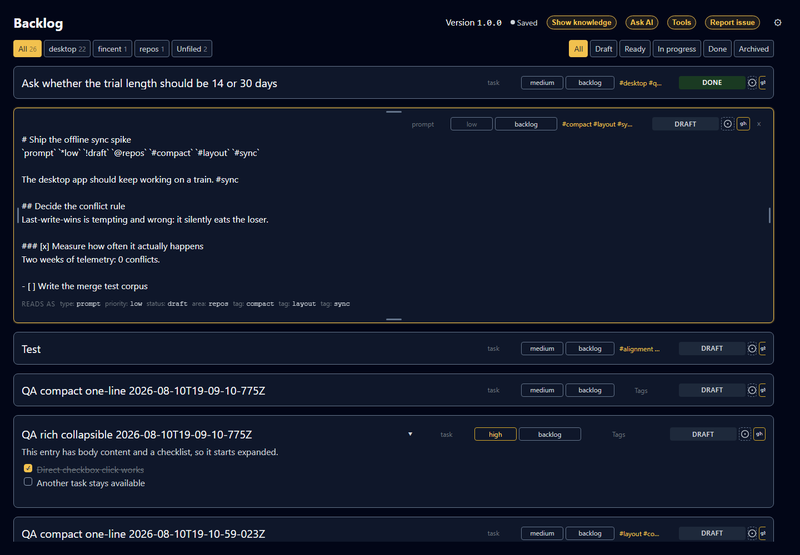

# Tasks

```meta
type: features
status: draft
```

> Features and sub-features this bounded context supports, described in
> business/ubiquitous language rather than implementation terms.

## Task creation

```meta
type: feature
status: draft
feature-flag: backlog
related: [.domain/inbox/features.md#routing]
```

Create tasks manually or from triaged inbox items, capturing title, body, type
(prompt, task, idea, follow-up), tags, and project/repo link. New tasks default
to `draft`.

## Refinement and prioritization

```meta
type: feature
status: draft
depends-on: [.domain/tasks/features.md#task-creation]
```

Edit and enrich tasks over time: set priority and status, add context links,
and flag oversized items with suggested splits. The desktop experience keeps
Markdown canonical while letting users adjust type, priority, repository,
status, and metadata tags directly from the reading layout. Expanded tasks
open into an inline Markdown editor for the full task body; compact tasks can
stay on one line when they only need metadata-level refinement.



### Filing a task against a roadmap tag

```meta
type: sub-feature
status: draft
related: [.domain/roadmap/domain.md#roadmap-tag, .domain/tasks/features.md#search-filter-and-organize]
```

Choose a task's tags from a picker that offers every
[Roadmap Item](../roadmap/domain.md#roadmap-item) tag alongside the tags already
in use, so a person can file a task against planned work by picking the plan's
own vocabulary rather than retyping — and matching it exactly, which is what lets
the roadmap gather the task back under that tag later.

The picker offers **every** roadmap tag, including ones no task has used yet, so
a task can be filed against planned work before anything else has been. That is
the point of borrowing the vocabulary rather than inventing a parallel one: the
tag a person picks here is the same slug the roadmap item holds, and it keeps
matching because the roadmap tag does not change when the item's title is renamed.
Tags remain free-form strings on the task — nothing forces a tag to come from the
roadmap — but the ones that do come from it line up on both sides on purpose.

### Sub-items and steps

```meta
type: sub-feature
status: draft
```

Break a task into ordered sub-items with title, status (pending → done), and
notes. Sub-items can be toggled between open and done from the rendered task,
reorder/add/remove independently, parent progress reflects completion (e.g. 3/5
done), and they can project to GitHub issue task lists.

A step is a sub-item; the product has one concept here, not two. A sub-item
carries those four attributes and nothing more — it has no type, priority, task
status or tags of its own, and none of the task's scheduling or dependency
attributes. A breakdown step needing its own priority is a task rather than a
step, and a step inherits its parent's deadline by belonging to it.

### Attached material

```meta
type: sub-feature
status: draft
related: [.domain/tasks/domain.md#attachment]
```

Point a task at the folder or archive where its material is kept — the review
pack, the screenshots, the exported data — and take the pointer off again. The
task says which place and what it is called, and whether that place is a folder
or an archive.

One place per task, not a list. What a person means by "the files for this" is
usually a folder they already keep them in, and a task that listed members
would grow its own presentation by however many files somebody dropped on it. A
second place is not a second attachment; it is either the same folder further up
or a different task.

A pointer, not a copy. Nothing is imported and nothing is stored beside the
task: the task stays the Markdown that gets committed and shared, and the
material stays where its owner put it. The consequence is stated rather than
hidden — a path is meaningful on the machine that wrote it, so a task read
somewhere else may name a place that is not there, and the task is no less valid
for it. Attaching is a claim about where material lives, not a promise that the
reader can reach it.

How much is in the place is not recorded, only where it is. A count would be true
at the moment it was written and wrong after the next file was added, and an
task that asserted one would be asserting something it cannot keep.

## Bulk editing

```meta
type: feature
status: draft
depends-on: [.domain/tasks/features.md#refinement-and-prioritization]
related: [.domain/tasks/features.md#search-filter-and-organize, .domain/tasks/features.md#my-day, .domain/tasks/features.md#recurring-tasks, .domain/tasks/features.md#multi-repo-targeting]
```

Select several tasks in the current view and set one field across all of them
at once, so a decision that applies to a batch is recorded once instead of
task by task. The selection is made in the list itself and carries a running
count of how many tasks it holds.

The fields that can be set this way are repo, status, type, priority, tags, My
Day, reminder, and due date. Setting a repo replaces whatever repos each task
targeted before. Tags are the exception to replacement: a bulk tag change adds
the chosen tags to every selected task, or withdraws one named tag from every
selected task, and leaves each task's remaining tags untouched. Status, type,
and priority always hold a value, so they can only be set; My Day, reminder,
and due date can also be cleared across the selection.

A bulk change reaches only the field being set. Every other field on every
selected task keeps the value it had, and a task already holding the target
value is left alone and counted as unchanged rather than rewritten.

The outcome is reported as a count of the tasks that changed. A task that
cannot be saved is reported alongside that count rather than abandoning the
rest of the batch, so a batch that only partly succeeds says so.

Marking a batch done spawns a successor for each recurring task it holds, on
the same terms as completing those tasks one at a time.

A selected task that leaves the current view — because a filter changed, or
because the change itself moved it out — leaves the selection with it.

## Effort registration

```meta
type: feature
status: draft
depends-on: [.domain/tasks/features.md#refinement-and-prioritization]
related: [.domain/tasks/domain.md#task, .domain/roadmap/features.md#gathering-work-under-an-item-and-totalling-its-effort]
```

Record how big a task is in **story points**, so the size of the work is a fact
about the task rather than a guess made every time someone reads the plan it sits
under. The estimate is optional: a task with none is simply not estimated, and
that is a normal state rather than a gap to be nagged about. Zero is a real
estimate — a genuinely trivial task — and is not the same as leaving it blank.

Story points size the work, they do not clock it. Two tasks that both took a day
can carry very different estimates if one was a far larger problem, and the number
does not move because the work turned out to take longer than expected; a
re-estimate happens when the *understanding of the size* changes, not when time
passes.

The estimate is often the AI's to make. Deriving a point value from the task's
own content is exactly the kind of judgement an assistant can offer, and it is
expected to do so — but a derived estimate is still an estimate, revised as the
work is understood better, and a person can always set or correct it by hand. The
deriving is not built yet; this feature makes the value **registrable and
visible**, which is what has to exist before anything can total it. When a roadmap
item gathers this task, the points registered here are what it
[adds up](../roadmap/features.md#gathering-work-under-an-item-and-totalling-its-effort) —
and a task left unestimated is counted as unestimated there, never silently as
zero.

## Scheduling and recurrence

```meta
type: feature
status: proposed
depends-on: [.domain/tasks/features.md#refinement-and-prioritization]
related: [.domain/tasks/domain.md#task]
```

Say when a task is due, when to be reminded of it, and whether it comes back.
Three separate facts rather than one: a deadline, an alarm, and a shape. A
backlog that could only say "Friday" could not distinguish the task that is due
that day from the one that should interrupt you that morning.

All three are optional and none of them changes the task lifecycle. A task
with a due date in the past is overdue, which is read by comparison rather than
recorded as a status, so nothing has to sweep the backlog to keep status honest.

The scheduling fields are written on the task's metadata line as named tokens
— `due:2026-08-21`, `remind:2026-08-21T09:00`, `repeat:weekly` — alongside the
existing sigil tokens for type, priority, status, area and tags. Named rather
than sigil-prefixed because the punctuation namespace is nearly exhausted and
five one-character marks for five date-shaped concepts would be unreadable in a
file people hand-edit.

### Due dates

```meta
type: sub-feature
status: proposed
```

Commit a task to a calendar day. A due date is a date and not an instant: it
carries no time and no timezone, so "due Friday" stays Friday when the device
moves. How that date is said on screen — "Today", "Friday, 21 August", or a
localized format — belongs to the channel showing it, not to the task.

### Reminders

```meta
type: sub-feature
status: proposed
```

Ask to be reminded of a task at a chosen local date and time. A reminder is
wall-clock intent: 09:00 means 09:00 wherever the person is when it arrives,
rather than the instant 09:00 once meant somewhere else.

A reminder is a request recorded on the task, not a promise about delivery. One
whose time has passed reads as overdue and keeps reading that way until it is
cleared or the task is completed, so a reminder that came due while the app was
closed surfaces rather than being silently missed.

### Recurring tasks

```meta
type: sub-feature
status: proposed
related: [.domain/tasks/domain.md#occurrence-spawning, .domain/tasks/features.md#archive-and-lifecycle]
```

Repeat a task on a schedule: every day, every week, every month, every year,
optionally restricted to particular weekdays so "every weekday" is expressible.
The repeat is anchored to the due date rather than to when the work actually
finished, so a task completed three days late still falls due on its original
weekday.

Completing a recurring task leaves it completed and creates the next occurrence
as a new task. The finished occurrence stays as the record of what was done
rather than being rolled forward and overwritten, which means a repeating task
accumulates one completed task per occurrence — archiving is what keeps that
from crowding the default views.

## My Day

```meta
type: feature
status: proposed
depends-on: [.domain/tasks/features.md#refinement-and-prioritization]
related: [.domain/tasks/features.md#scheduling-and-recurrence]
```

Pick the tasks to work on today, separately from when they are due. My Day is
this morning's decision about what to look at, and it is deliberately not a
deadline: a task due next Friday can be in today's My Day, and a task due
today need not be.

Because it is a decision about a particular day, it expires on its own. A task
carries the date it was picked for, and it is in My Day exactly while that date
is the reader's current local date — so yesterday's list clears itself with no
timer, no timezone rule and no overnight sweep, and a device that was switched
off for a week comes back to an empty My Day rather than a stale one.

## Task dependencies

```meta
type: feature
status: proposed
depends-on: [.domain/tasks/features.md#refinement-and-prioritization]
related: [.domain/tasks/domain.md#task, .domain/tasks/features.md#manual-ordering]
```

Record that a task waits on other tasks, so a set of prompts or tasks meant
to be worked in order says so instead of relying on the reader remembering.
A task can wait on several others: needing two things finished before it can
start is ordinary, and asking which of the two is the real predecessor has no
answer.

This is a different fact from manual ordering. Ordering is the sequence a person
arranged the backlog in; a dependency is a constraint that holds whatever order
the list happens to be shown in.

### Readiness and chain order

```meta
type: sub-feature
status: proposed
```

Read off what can actually be started. A task is done, ready when everything
it waits on is finished, or blocked when something is not — and a blocked task
says what it is waiting for rather than only that it cannot proceed. Readiness is
derived every time it is read, never stored, so finishing one task unblocks its
dependents with nothing to recalculate or keep in sync.

Two questions get separate answers because they are separate questions: which
task to pick up first, and which tasks could be started now. In a straight
chain those are the same task; when finishing one step unblocks three, they are
not, and a view that answered only the first would leave the other two to be
noticed by their waiting lines disappearing.

A dependency naming a task that cannot be found still blocks. Treating an
unresolvable id as satisfied would let a chain report itself ready when the step
it waits on is merely missing from view, which is the one failure that looks
exactly like success. Dependency loops are named rather than broken: which edge
in a loop is the wrong one is answerable only by the person who wrote them.

## Multi-repo targeting

```meta
type: feature
status: draft
depends-on: [.domain/tasks/features.md#task-creation]
related: [.domain/tasks/features.md#projection]
```

Let one logical task target multiple repositories (`repo_ids[]`) while remaining
a single source of truth — one item, one priority, one status — with a unified
view across all contexts.

## Projection

```meta
type: feature
status: draft
depends-on: [.domain/tasks/features.md#multi-repo-targeting]
related: [.domain/monitoring/features.md#tasks-and-github-progress]
```

Spawn and close downstream artifacts from a task: one GitHub issue and/or
Copilot CLI task per target repo, created when work starts and closed on
completion, without duplicating the task.

### Issue projection and state read-back

```meta
type: sub-feature
status: draft
feature-flag: github-integration
related: [.domain/repository-management/features.md#github-access-resolution, .domain/monitoring/features.md#tasks-and-github-progress]
```

Push a task to its target repository as an issue carrying the task's title,
body, and tags, and keep the resulting issue reference on the task so the link
is part of the item rather than a note about it. The task can then be asked to
re-read that issue's current state, and the pull request that references it, so
downstream progress is visible from the backlog. Reading GitHub state is a
deliberate act rather than a background poll, because the backlog has to open
instantly and offline.

## Search, filter and organize

```meta
type: feature
status: draft
related: [.domain/second-brain/features.md#bi-directional-linking]
```

Search across title, body, tags, and linked knowledge notes; filter by area
(a self-chosen grouping such as "repos", "projects", or "inbox"), repo, type,
status, priority, and recency; grouped views; and inline embedding of Second
Brain content.

### Manual ordering

```meta
type: sub-feature
status: draft
```

Hand-sequence tasks within the backlog by dragging them into a preferred
order, independent of recency or priority. A task that has never been
manually ranked falls back to recency.

## Prompt features

```meta
type: feature
status: draft
```

One-click copy of prompt text to clipboard, usage-history logging on copy/use,
and reopening historical prompts from the usage log.

### Hand-off to Copilot CLI

```meta
type: sub-feature
status: draft
feature-flag: copilot-cli
related: [.domain/productivity/features.md#ai-activity-capture]
```

Hand a task to GitHub Copilot CLI as a task brief without retyping it: the
task's own markdown — title, metadata, body, and sub-items — is the brief, and
the hand-off is recorded in the task's usage history so the task itself shows
that AI was put to work on it.

## Import

```meta
type: feature
status: proposed
depends-on: [.domain/tasks/features.md#task-creation, .domain/tasks/features.md#task-dependencies, .domain/tasks/features.md#multi-repo-targeting]
related: [.domain/tasks/features.md#prompt-features, .domain/tasks/features.md#sub-items-and-steps, .domain/tasks/features.md#filing-a-task-against-a-roadmap-tag, .domain/tasks/domain.md#task-type, .domain/tasks/domain.md#task-status, .domain/repository-management/features.md#repository-registration]
```

Bring in a plan that lists a sequence of work to do across one or more
repositories, in the order its entries depend on each other, and turn the whole
plan into tasks in one step instead of typing each one in by hand. Most plans
are sequences of AI prompts to run, which is the case Import was written for. A
plan can be brought in as an uploaded file or pasted directly, whichever is
faster in the moment — both read the same plan. Import builds nothing that task
creation does not already offer — it is a faster way of filling the backlog,
not a second way of holding work.

Each entry in the plan becomes one [Task](domain.md#task) of the
[type](domain.md#task-type) the plan states for it — the same four types
[task creation](#task-creation) already offers, with `prompt` the common case
because an AI prompt to run is what a plan mostly holds. An entry that states no
type becomes a plain `task`, the default a hand-typed task gets. So one plan can
legitimately mix kinds without announcing that it does: the prompts to run
alongside the step only a person can do and the thing worth coming back to
later. Import reads the type off the entry rather than deciding for the plan
that its entries are all of a kind.

An entry may also state the [status](domain.md#task-status) it should arrive at,
so a plan whose opening steps are already agreed can bring them in `ready`
rather than leaving somebody to promote each one out of `draft` by hand. What
the plan states is the status the task is created with — the value directly,
not a lifecycle step applied on top of a new task — so every status is
reachable this way, the settled ones included, and a plan can record a step
that was finished before the plan was ever imported. An entry stating no status
starts at `draft`, like any other new task.

The entry's own instructions become that task's body, and the order the plan
declares between entries becomes an ordinary
[task dependency](#task-dependencies) between the tasks import
creates — the same relationship a person would have typed by hand, resolved
from the plan's own local entry references to the real task ids as the
tasks are created. "What's next" for an imported chain reads no differently
than for any other: by [Readiness](domain.md#readiness), grouped by
[repository](#multi-repo-targeting). The plan itself becomes one of the
task's tags, filed the same way a task is
[filed against a roadmap tag](#filing-a-task-against-a-roadmap-tag), so
everything one plan brought in can be found and filtered as a group without a
separate "which plan was this" lookup.

A plan also carries work around a prompt that is not the prompt itself: a
setup or dependency step the repository needs before the prompt can run —
installing a plugin, say — a reminder to update that repository's knowledge
docs or devbook, and a task only a person can do. None of these are a new
kind of thing. They land as ordinary [sub-items](#sub-items-and-steps) on the
task they belong to, ordered ahead of the entry they gate. A step is a step
whichever list it came from; import adds no second vocabulary for what a
sub-item already says, and a sub-item created by import is indistinguishable
from one a person typed by hand, because it is the same thing.

Every task import creates carries where it came from — see
[Task](domain.md#task) — so a batch of entries brought in
together stays traceable back to the plan and the specific item that produced
each one.

### Repository resolution on import

```meta
type: sub-feature
status: proposed
related: [.domain/repository-management/features.md#repository-registration, .domain/repository-management/domain.md#repository-registry]
```

Resolve each entry's target repository by the name the plan's author wrote,
against the same [Repository Registry](../repository-management/domain.md#repository-registry)
[multi-repo targeting](#multi-repo-targeting) already resolves `repo_ids`
against. A name the registry already knows resolves to its `repo_id` as
usual. A name the registry has never seen is registered there on the spot,
using Repository Management's existing
[registration capability](../repository-management/features.md#repository-registration),
before the task naming it is created — so a plan can introduce a repository
to the product just by mentioning it, without a separate registration step
first.

Import triggers registration; it does not perform it. The repository is
registered with whatever the plan states about it (at minimum, its name); what
a registered repository holds and how registration behaves stays Repository
Management's decision, and Import gains no authority over it beyond the
ability to ask for it.

The Import dialog also offers a "Target repository" field for the whole
batch: when filled in, it is applied as the resolved repository for any
entry in the plan that names none of its own, without touching an entry that
already carries its own `repo:` token.

### Re-importing an updated plan

```meta
type: sub-feature
status: proposed
related: [.domain/tasks/domain.md#task, .domain/tasks/domain.md#task-status]
```

Bring in a later version of a plan already imported once, and have it adjust
the tasks still in flight rather than duplicate them. Each entry in a plan
keeps the same id across versions, so a later import recognizes "this is the
same entry, updated" instead of "this is a new entry" — the plan's id
together with the entry's id inside it is what a task remembers about
where it came from, and what a later import matches against.

A task a previous import produced, and that is not yet `done` or
`archived`, is updated in place from the new version: its instructions, its
type, its dependencies, its target repository, and its setup/knowledge/manual
sub-items are replaced with what the new version says. Status is the one field
a later version moves only when it asks to: restate it and the task moves
there, leave it out and the task keeps whatever progress it has made since it
was imported — a plan that says nothing about where an entry stands is not
asking for work already under way to be sent back to `draft`. An entry the plan
no longer mentions is left as it is — import removes nothing on its own. A
task already `done` or `archived` is never touched by a later import: the whole
entry is skipped, a restated status included, the same way finishing a
recurring task leaves that occurrence as the settled record of
what was done rather than something a later change reopens. An entry id the
first import never produced a task for is simply created new, whichever
version of the plan introduced it.

## AI assistance over the visible backlog

```meta
type: feature
status: draft
feature-flag: ai-assistant
related: [.domain/second-brain/features.md#repository-knowledge-areas, .domain/productivity/features.md#ai-productivity-tracking]
```

Ask questions about the work currently in view and get an answer grounded in it.
The question is answered from the tasks the active filters leave visible plus
the loaded backlog knowledge, not from the entire backlog, so the answer matches
what the person is actually looking at. Entries that were opened but never
edited are left out, and the assembled context is capped so a large backlog
degrades into a partial answer rather than a failure. AI assistance is an opt-in
capability and the product remains fully usable with it switched off.

## Archive and lifecycle

```meta
type: feature
status: draft
related: [.domain/tasks/flow.md]
```

Move tasks between active and archived states; archived tasks are excluded
from default views but always accessible and restorable.

Completing a task and then reopening it returns it to `in_progress`, whatever
status it held before it was finished; the earlier status is deliberately not
kept. Finishing is a recorded fact rather than a step that rewinds, so
reopening starts the work again rather than restoring where it stood before.
`flow.md` holds the lifecycle this follows.

## Refresh from shared storage

```meta
type: feature
status: draft
related: [.arc42/06-runtime-view.md#state-sync-and-webhook-forwarding]
```

Automatically refresh when another process or device modifies the shared backlog,
keeping changes synchronized across machines accessing the same data. Enable or
disable this feature and configure the refresh interval in Settings → Storage. This
is an interim mechanism while the cloud Sync module is in development; the eventual
architecture will use direct push updates instead.

## Roadmap planning

```meta
type: feature
status: deprecated
depends-on: [.domain/tasks/features.md#refinement-and-prioritization]
related: [.domain/roadmap/features.md, .domain/roadmap/domain.md#roadmap-plan, .domain/tasks/domain.md#task]
```

**Superseded.** Roadmap planning is a bounded context of its own — see
[Roadmap Planning](../roadmap/features.md). This chapter is kept, at this heading,
because other chapters reference it; it is not the model any more.

What this chapter used to say was that the roadmap groups *selected backlog
tasks* by theme, horizon, environment or repository, and that its progress is
derived from those tasks rather than stored. The first half turned out to be too
narrow: a plan has to be able to hold work that has not been refined into a task
yet, which is most of what planning is, so the plan is stored in its own right and
a planned item may *optionally* name the task that executes it.

The second half survives, and is the part worth carrying forward: **Task
remains the source of truth for a work item's status and execution priority.**
Roadmap Planning owns planning priority and sequence; it never writes a task's
status or priority, and the progress it shows for a linked item is read from the
task rather than maintained by hand.

What Tasks keeps from this feature is the
[refinement and prioritization](#refinement-and-prioritization) that makes
a task ready in the first place, and the
[Partnership link](../roadmap/dependencies.md) that lets a plan point at it.

### Roadmap views

```meta
type: sub-feature
status: deprecated
related: [.domain/roadmap/features.md#reading-and-rescheduling-on-a-timeline]
```

**Superseded** by
[reading and rescheduling on a timeline](../roadmap/features.md#reading-and-rescheduling-on-a-timeline)
and
[reading the plan by repository](../roadmap/features.md#reading-the-plan-by-repository)
in Roadmap Planning. Now/Next/Later is not how the plan is read — a horizon is a
grouping, and the plan is read against dates, in repository bands with the
person's own lanes inside them.