# Flow: Technology Stack

```meta
status: draft
```

> Lifecycle and process flows for this bounded context. Flows describe how a
> technology moves through its adoption states over time — complementary to
> `model.md` (structure) and `domain.md` (responsibilities/invariants).

## Technology lifecycle

```mermaid
stateDiagram-v2
    [*] --> Beta : Proposed and added to registry
    Beta --> Stable : Approved for portfolio use
    Stable --> Deprecated : New version; EOL date + migration set
    Deprecated --> Unsupported : EOL reached; exceptions flagged
    Unsupported --> [*]
    Stable --> Beta : Reverted to evaluation (edge case)
```


