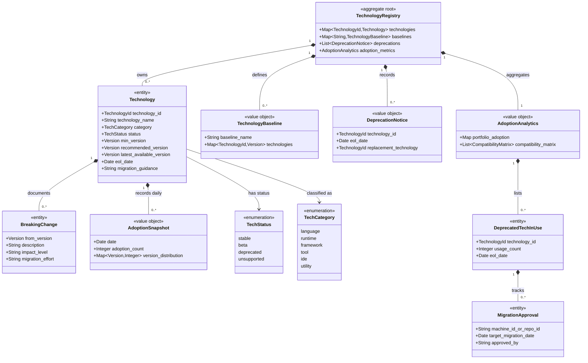

# Domain Model: Technology Stack

> Structural view of the domain model for this bounded context: aggregates,
> entities, value objects, and their relationships. Keep this in sync with
> `domain.md` (which describes responsibilities/invariants in prose) — this
> file focuses on structure and relationships.

## Model diagram

## Relationship notes

- `TechnologyRegistry` is the single aggregate root (global singleton).
  `Technology`, `BreakingChange`, `DeprecatedTechInUse`, and `MigrationApproval`
  are owned entities; the remaining classes are immutable value objects.
- `AdoptionSnapshot`, `VersionUsageMetric`, `AdoptionTrend`, and
  `CompatibilityMatrix` (see `domain.md`) roll up into `AdoptionAnalytics`; only
  the aggregate root writes them.
- Baselines and adoption reference machines/repos by id only; Dev PC and
  Repository Management report versions inward and consume baselines outward, so
  no foreign aggregate is held here.
