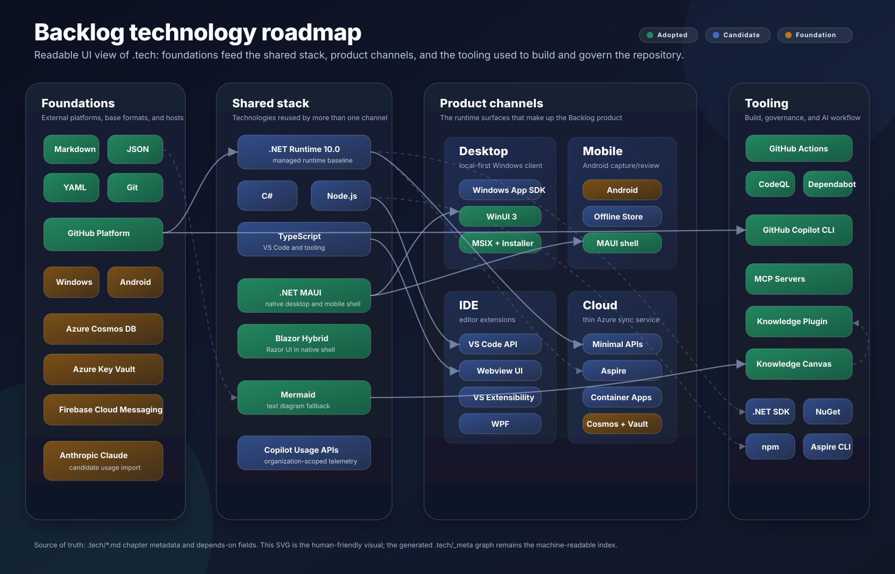
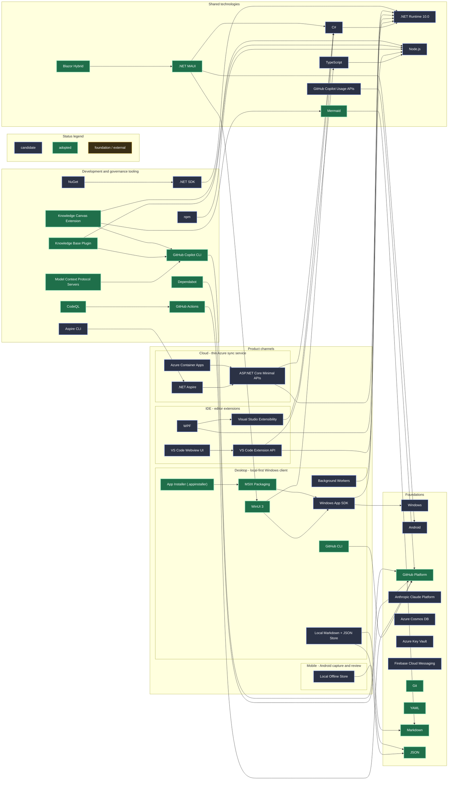

# Technology Graph

```meta
status: candidate
order: ["shared.md", "desktop.md", "ide.md", "mobile.md", "cloud.md", "tooling.md", "assets"]
related: [".arc42/04-solution-strategy.md#technology-choices", ".arc42/07-deployment-view.md", ".arc42/09-architecture-decisions.md"]
```

> The root view of `.tech`: which technologies this project is built with, how
> they layer on each other, and how mature each choice is. Individual
> technologies are documented as chapters in the layer files listed below.

The project is in bootstrap, so most nodes are `candidate` — named as the
intended choice in `.arc42` but not yet proven by running code. The tooling
layer is the exception: it is already in daily use.

## Layers

| Layer | File | Covers |
|---|---|---|
| Shared | [`shared.md`](shared.md) | Formats, languages, and runtimes used by more than one channel |
| Desktop | [`desktop.md`](desktop.md) | The canonical local-first Windows client |
| Mobile | [`mobile.md`](mobile.md) | The Android capture-and-review client |
| IDE | [`ide.md`](ide.md) | VS Code and Visual Studio extensions |
| Cloud | [`cloud.md`](cloud.md) | The optional, thin Azure sync service |
| Tooling | [`tooling.md`](tooling.md) | Build, CI/CD, AI, and governance tooling for this repository |

## Graph

The primary visual roadmap is stored as SVG so it can be rendered directly by
GitHub and richer viewers without depending on Mermaid layout quality:



Edges in the fallback graph still point from a technology to what it sits on top
of, mirroring the `depends-on` field of each chapter.

<details>
<summary>Mermaid fallback and source graph</summary>


</details>

Nodes without an outgoing edge (`YAML`, `Git`, `Windows`, `Android`,
`GitHub Platform`, `Anthropic Claude Platform`, `Azure Cosmos DB`,
`Azure Key Vault`, `Firebase Cloud Messaging`) are foundations: nothing in
this project sits below them.

## Status ladder

| Status | Meaning |
|---|---|
| `candidate` | Named as the intended choice, not yet validated by real use |
| `trial` | Being tried out in a limited, reversible way |
| `adopted` | In active use and the default choice for its role |
| `hold` | Kept but no longer expanded; avoid new usage |
| `retired` | No longer used; kept for history |

## How to read and extend this graph

- Each `## <Technology>` chapter in a layer file is one node. Its
  `depends-on` list is its outgoing edges, using
  `<path>#<heading-slug>` references.
- A technology is documented **once**, in the layer that owns it. Anything used
  by two or more channels moves to `shared.md`.
- Rationale lives in `.arc42` (solution strategy, ADRs). Chapters here link to
  it with `related` instead of restating it.
- When a node or edge changes, update both the SVG roadmap and the Mermaid fallback in the same change.

Full authoring rules: `knowledge-tech.instructions.md` from the
`knowledge-base` plugin.

## Open questions

- Mobile shape is unsettled: MAUI native vs. Blazor Hybrid vs. PWA. Desktop's
  shape is decided (`.arc42/adr/0001-desktop-stack-maui-blazor-hybrid.md`:
  MAUI Blazor Hybrid, WinUI 3 head).
- Cloud data store choice (Cosmos DB vs. PostgreSQL) is still open in
  `.arc42/04-solution-strategy.md#technology-choices`.
- No versions are pinned yet beyond the target .NET runtime; `version` fields
  fill in as projects are created.
