# Technology Graph

```meta
status: adopted
related: [".arc42/04-solution-strategy.md#technology-choices", ".arc42/07-deployment-view.md", ".arc42/09-architecture-decisions.md"]
```

> The root view of `.tech`: which technologies this project is built with, how
> they layer on each other, and how mature each choice is. Individual
> technologies are documented as chapters in the layer files listed below.

Bootstrap is over for most of the stack. The shared runtimes and frameworks, the
desktop channel, the testing layer, and everything used to build and govern the
repository are in daily use and marked `adopted`. What is still `candidate` is
concentrated in three places: the Azure deployment targets the sync service will
eventually run on, the Visual Studio channel, and the parts of the desktop and
mobile clients that are designed but not yet implemented.

## Layers

| Layer | File | Covers |
|---|---|---|
| Shared | [`shared.md`](shared.md) | Formats, languages, runtimes, and the frameworks and packages used by more than one channel |
| Desktop | [`desktop.md`](desktop.md) | The canonical local-first Windows client |
| IDE | [`ide.md`](ide.md) | VS Code and Visual Studio extensions |
| Mobile | [`mobile.md`](mobile.md) | The Android capture-and-review client |
| Cloud | [`cloud.md`](cloud.md) | The thin Azure sync service and the managed AI service the product calls |
| Testing | [`testing.md`](testing.md) | Test frameworks, runners, and end-to-end validation |
| AI development | [`ai-development.md`](ai-development.md) | The agent harnesses, protocols, and file conventions this repository is built *with* |
| Tooling | [`tooling.md`](tooling.md) | Build, packaging, CI/CD, deployment, and governance tooling |

The table is in reading order, which `_meta/index.json` pins.

## Graph

The application renders this metadata as an embedded interactive roadmap with
layer lanes, status styling, and selectable dependency highlighting. The source
Mermaid graph below remains the portable fallback and keeps edges pointing from a
technology to what it sits on top of, mirroring each chapter's `depends-on`
field.

```mermaid
flowchart LR
    subgraph Legend["Status legend"]
        CandidateLegend["candidate"]:::candidate
        AdoptedLegend["adopted"]:::adopted
        HoldLegend["hold"]:::hold
        FoundationLegend["foundation / external"]:::foundation
    end

    subgraph Foundations["Foundations"]
        Windows["Windows"]:::adopted
        Android["Android"]:::adopted
        JavaJdk["Java JDK"]:::adopted
        GitHubPlatform["GitHub Platform"]:::adopted
        Anthropic["Anthropic Claude Platform"]:::candidate
        Foundry["Azure AI Foundry"]:::adopted
        Cosmos["Azure Cosmos DB"]:::candidate
        KeyVault["Azure Key Vault"]:::candidate
        FCM["Firebase Cloud Messaging"]:::candidate
        Git["Git"]:::adopted
        PowerShell["PowerShell"]:::adopted
        AzureCli["Azure CLI"]:::adopted
        ClaudeCode["Claude Code"]:::adopted
        YAML["YAML"]:::adopted
        Markdown["Markdown"]:::adopted
        JSON["JSON"]:::adopted
        DotNet[".NET Runtime"]:::adopted
        NodeJS["Node.js"]:::adopted
    end

    subgraph Shared["Shared technologies"]
        Mermaid["Mermaid"]:::adopted
        CSharp["C# Language"]:::adopted
        TypeScript["TypeScript"]:::adopted
        AspNetCore["ASP.NET Core"]:::adopted
        RazorComponents["Razor Components"]:::adopted
        BlazorServer["Blazor Server"]:::adopted
        MAUI[".NET MAUI"]:::adopted
        BlazorHybrid["Blazor Hybrid"]:::adopted
        Aspire[".NET Aspire"]:::adopted
        Otel["OpenTelemetry"]:::adopted
        Sqlite["SQLite"]:::adopted
        DataSqlite["Microsoft.Data.Sqlite"]:::adopted
        MexDi["Microsoft.Extensions.DependencyInjection"]:::adopted
        MexHttp["Microsoft.Extensions.Http"]:::adopted
        MexResilience["Microsoft.Extensions.Http.Resilience"]:::adopted
        MexDiscovery["Microsoft.Extensions.ServiceDiscovery"]:::adopted
        MexLogging["Microsoft.Extensions.Logging"]:::adopted
        YamlDotNet["YamlDotNet"]:::hold
        CopilotUsage["GitHub Copilot Usage APIs"]:::candidate
    end

    subgraph ProductChannels["Product channels"]
        direction TB

        subgraph Desktop["Desktop - local-first Windows client"]
            WinAppSDK["Windows App SDK"]:::adopted
            WinUI["WinUI 3"]:::adopted
            WebView2["WebView2"]:::adopted
            LocalStore["Local Task Store"]:::adopted
            Workers["Background Workers"]:::candidate
            GhCli["GitHub CLI"]:::adopted
            MSIX["MSIX Packaging"]:::adopted
            AppInstaller["App Installer (.appinstaller)"]:::adopted
        end

        subgraph Mobile["Mobile - Android capture and review"]
            OfflineStore["Local Offline Store"]:::candidate
            AndroidTools["Android SDK Build Tools"]:::adopted
            APK["APK Packaging"]:::adopted
        end

        subgraph IDE["IDE - editor extensions"]
            VSCodeApi["VS Code Extension API"]:::adopted
            Webview["VS Code Webview UI"]:::candidate
            VSSDK["Visual Studio Extensibility"]:::candidate
            WPF["WPF"]:::candidate
        end

        subgraph Cloud["Cloud - Azure services"]
            MinimalApis["ASP.NET Core Minimal APIs"]:::adopted
            ACA["Azure Container Apps"]:::candidate
        end
    end

    subgraph Testing["Testing and validation"]
        XUnit["xUnit v3"]:::adopted
        MTP["Microsoft.Testing.Platform"]:::adopted
        TestSdk["Microsoft.NET.Test.Sdk"]:::adopted
        VsRunner["xunit.runner.visualstudio"]:::adopted
        TrxReport["Microsoft.Testing.Extensions.TrxReport"]:::adopted
        BUnit["bUnit"]:::adopted
        Coverlet["coverlet"]:::adopted
        Playwright["Playwright"]:::adopted
    end

    subgraph AiDev["AI-assisted development"]
        CopilotCli["GitHub Copilot CLI"]:::adopted
        Plugins["Claude Code Plugins"]:::adopted
        Skills["Agent Skills"]:::adopted
        Subagents["Subagents"]:::adopted
        MCP["Model Context Protocol Servers"]:::adopted
        Dashboard["Orchestration Dashboard"]:::adopted
        InstructionFiles["Repository Instruction Files"]:::adopted
        Hooks["Claude Code Hooks"]:::adopted
        KnowledgePlugin["Knowledge Base Plugin"]:::adopted
        Canvas["Knowledge Canvas Extension"]:::adopted
        Worktrees["Git Worktree Sessions"]:::adopted
    end

    subgraph Tooling["Build and governance tooling"]
        DotNetSdk[".NET SDK"]:::adopted
        MSBuild["MSBuild"]:::adopted
        MauiWorkloads[".NET MAUI Workloads"]:::adopted
        NuGet["NuGet"]:::adopted
        CPM["Central Package Management"]:::adopted
        Npm["npm"]:::adopted
        Bicep["Bicep"]:::adopted
        AspireCli["Aspire CLI"]:::adopted
        Actions["GitHub Actions"]:::adopted
        CodeQL["CodeQL"]:::adopted
        Dependabot["Dependabot"]:::adopted
        KnowledgeMeta["knowledge-meta Generator"]:::adopted
        Archify["Archify"]:::adopted
        Ajv["Ajv"]:::adopted
        SimpleIcons["simple-icons"]:::adopted
    end

    Mermaid --> Markdown
    CSharp --> DotNet
    TypeScript --> NodeJS
    AspNetCore --> DotNet
    AspNetCore --> CSharp
    RazorComponents --> AspNetCore
    RazorComponents --> CSharp
    BlazorServer --> RazorComponents
    BlazorServer --> AspNetCore
    MAUI --> WinUI
    MAUI --> Android
    MAUI --> CSharp
    BlazorHybrid --> MAUI
    BlazorHybrid --> RazorComponents
    Aspire --> AspNetCore
    Aspire --> CSharp
    Otel --> DotNet
    Sqlite --> Markdown
    DataSqlite --> Sqlite
    DataSqlite --> DotNet
    MexDi --> DotNet
    MexHttp --> DotNet
    MexResilience --> MexHttp
    MexDiscovery --> Aspire
    MexLogging --> DotNet
    YamlDotNet --> DotNet
    CopilotUsage --> GitHubPlatform

    WinAppSDK --> Windows
    WinAppSDK --> DotNet
    WinUI --> WinAppSDK
    WinUI --> CSharp
    WebView2 --> WinAppSDK
    LocalStore --> Sqlite
    LocalStore --> DataSqlite
    LocalStore --> JSON
    Workers --> DotNet
    GhCli --> GitHubPlatform
    MSIX --> WinAppSDK
    AppInstaller --> MSIX

    OfflineStore --> JSON
    AndroidTools --> Android
    AndroidTools --> JavaJdk
    APK --> Android
    APK --> AndroidTools

    VSCodeApi --> TypeScript
    VSCodeApi --> NodeJS
    Webview --> VSCodeApi
    VSSDK --> CSharp
    WPF --> VSSDK
    WPF --> DotNet

    MinimalApis --> AspNetCore
    MinimalApis --> CSharp
    ACA --> MinimalApis

    XUnit --> DotNet
    XUnit --> CSharp
    MTP --> XUnit
    TestSdk --> MTP
    VsRunner --> XUnit
    TrxReport --> MTP
    BUnit --> RazorComponents
    BUnit --> XUnit
    Coverlet --> TestSdk
    Playwright --> BlazorServer
    Playwright --> WebView2

    CopilotCli --> GitHubPlatform
    Plugins --> ClaudeCode
    Plugins --> CopilotCli
    Skills --> Plugins
    Skills --> Markdown
    Skills --> YAML
    Subagents --> Plugins
    MCP --> ClaudeCode
    MCP --> CopilotCli
    Dashboard --> MCP
    InstructionFiles --> Markdown
    Hooks --> ClaudeCode
    Hooks --> PowerShell
    KnowledgePlugin --> Plugins
    KnowledgePlugin --> NodeJS
    Canvas --> Plugins
    Canvas --> NodeJS
    Canvas --> Mermaid
    Worktrees --> Git

    DotNetSdk --> DotNet
    MSBuild --> DotNetSdk
    MauiWorkloads --> DotNetSdk
    MauiWorkloads --> MAUI
    NuGet --> DotNetSdk
    CPM --> NuGet
    Npm --> NodeJS
    Bicep --> AzureCli
    AspireCli --> Aspire
    Actions --> GitHubPlatform
    CodeQL --> Actions
    Dependabot --> GitHubPlatform
    KnowledgeMeta --> NodeJS
    KnowledgeMeta --> JSON
    Archify --> NodeJS
    Archify --> Mermaid
    Ajv --> Archify
    Ajv --> JSON
    SimpleIcons --> Archify

    classDef adopted fill:#1f6f4a,stroke:#9be7c3,color:#fff,stroke-width:2px
    classDef candidate fill:#2b3245,stroke:#8aa4ff,color:#fff,stroke-width:1.5px
    classDef hold fill:#4a2b2b,stroke:#ffa8a8,color:#fff,stroke-width:1.5px
    classDef foundation fill:#3a2f14,stroke:#ffd166,color:#fff,stroke-width:1.5px
```

<details>
<summary>Mermaid source graph</summary>


</details>

Nodes without an outgoing edge are foundations: nothing in this project sits
below them. They are the three text formats (`Markdown`, `JSON`, `YAML`), the two
base runtimes (`.NET Runtime`, `Node.js`), the two operating systems and the JDK
(`Windows`, `Android`, `Java JDK`), the external services (`GitHub Platform`,
`Anthropic Claude Platform`, `Azure AI Foundry`, `Azure Cosmos DB`,
`Azure Key Vault`, `Firebase Cloud Messaging`), and the four host-level tools
(`Git`, `PowerShell`, `Azure CLI`, `Claude Code`).

## Status ladder

| Status | Meaning |
|---|---|
| `candidate` | Named as the intended choice, not yet validated by real use |
| `trial` | Being tried out in a limited, reversible way |
| `adopted` | In active use and the default choice for its role |
| `hold` | Kept but no longer expanded; avoid new usage |
| `retired` | No longer used; kept for history |

## AI development vocabulary

The [AI Coding Dictionary](https://www.aicodingdictionary.com/) names the
concepts of agent-driven development. This project is built that way, so its
terms describe real, checked-in things here rather than background theory. This
table is the index: it says what each term denotes **in this repository**, and
which chapter of [`ai-development.md`](ai-development.md) carries the technology
behind it.

Terms below are the dictionary's; the right-hand column is this repository.

### The model

| Term | In this repository |
|---|---|
| Model provider | Two, in two different roles: the harness's own provider (Anthropic, via [Claude Code](ai-development.md#claude-code)), and the product's, [Azure AI Foundry](cloud.md#azure-ai-foundry) — `gpt-5-4`, `gpt-5-5`, `gpt-5-6-luna`, with a balanced and a speech model behind Bicep parameters |
| Model, inference, next-token prediction, parameters, training | Vendor-side concepts. Nothing here configures them. |
| Harness | [Claude Code](ai-development.md#claude-code) and the [GitHub Copilot CLI](ai-development.md#github-copilot-cli). The repository is governed for both. |
| Effort | Not configured. `.claude/orch-context.md` records that this repository sets no model or effort override; runs take each plugin's default. |
| Token, input/output tokens, cache tokens, prefix cache | Measured, not configured: `Backlog.Infrastructure.Claude` imports token counts and cost from the Admin API, and `Backlog.Infrastructure.GitHub` does the same for Copilot, for the Productivity domain. |
| Non-determinism | Why the [testing layer](testing.md) exists in the shape it does — deterministic checks (`dotnet test`, `knowledge-meta`, CodeQL) gate what a non-deterministic agent produces. |

### Sessions, context windows, and turns

| Term | In this repository |
|---|---|
| Agent | Every `orch-*` run, plus the specialist [subagents](ai-development.md#subagents) a stage is handed to |
| Session | One worktree's run. [Git worktree sessions](ai-development.md#git-worktree-sessions) are the isolation unit; `.claude/` holds per-session state. |
| System prompt | Composed from the harness plus [repository instruction files](ai-development.md#repository-instruction-files) |
| Context window | The budget the [orchestration dashboard](ai-development.md#orchestration-dashboard)'s handoff marker exists to survive |
| Turn, stateful, stateless | Harness-level. The repository's own statefulness is the dashboard run record and the checked-in knowledge folders. |

### Tools and environment

| Term | In this repository |
|---|---|
| MCP | [Model Context Protocol servers](ai-development.md#model-context-protocol-servers): `jsdotnet-project-guidelines`, `jsdotnet-project-design`, the Aspire and [Playwright](testing.md#playwright) servers, and the orchestration dashboard |
| Tool, tool call, tool result | The MCP surfaces above, plus the harness's own file and shell tools |
| Environment | The Aspire app model: [.NET Aspire](shared.md#net-aspire) is what gives an agent a running system to observe, with logs and traces |
| Filesystem | The worktree. `.github/instructions/context-loading.instructions.md` limits which knowledge folders a given workflow may read. |
| Sandbox | The git worktree, plus `aspire start --isolated` for ports and user-secrets state |
| Permission mode, permission request | Harness-level; the repository does not pin one. The equivalent repository-level gate is Personal Validation, which no run may skip. |

### Failure modes

| Term | In this repository |
|---|---|
| Knowledge cutoff | Why `microsoft-code-reference` and the guideline MCP servers are consulted rather than answered from memory |
| Parametric vs. contextual knowledge | The whole reason `.arc42`, `.domain`, `.tech`, and `.design` are checked in: project facts are read, not recalled |
| Attention degradation, smart zone | Why long runs hand off rather than continue, and why chapters are kept short |
| Hallucination | What deterministic checks catch: a broken `depends-on` fails `knowledge-meta`, a wrong API fails the build |
| Sycophancy | Addressed procedurally, by the `review` plugin's adversarial review skills |

### Handoffs

| Term | In this repository |
|---|---|
| Handoff, handoff artifact | The dashboard's handoff marker and note, so a resumed run reattaches instead of opening a duplicate |
| Compaction, autocompact, clearing | Harness-level. The repository's contribution is making a fresh session cheap to start: the standing brief plus the knowledge folders. |
| Primary source | The code, `Directory.Packages.props`, the workflows, `.arc42` — what a `.tech` chapter is written *from* |
| Secondary source | This folder. `.tech` records outcomes; `.arc42` keeps the reasoning, and where the two disagree `.arc42` wins. |
| Spec, ticket | `.backlog/` work items and the GitHub issues they sync with; `.claude/hooks/spawn-task-to-issue.ps1` turns an out-of-scope finding into one |

### Memory and steering

| Term | In this repository |
|---|---|
| AGENTS.md | Spelled `CLAUDE.md` and `.github/copilot-instructions.md` here — see [repository instruction files](ai-development.md#repository-instruction-files) |
| Context pointer | Every `related` and `depends-on` reference, and the standing brief's links into `.github/instructions/` |
| Progressive disclosure | The design of the whole knowledge convention: a short brief points at scoped instruction files, which point at chapters, which point at each other |
| Skill | [Agent Skills](ai-development.md#agent-skills): the plugin `orch-*` orchestrations, `.github/skills/pr-jsdotnet`, and the five `.agents/skills/` Aspire skills |
| Subagent | [Subagents](ai-development.md#subagents) — `architecture:architect`, `csharp-coding:coding`, `qa:qa`, and the rest |
| Memory system | Not adopted. Cross-session state is deliberately the checked-in knowledge folders and the dashboard run record, both of which a human can read and diff. |

### Patterns of work

| Term | In this repository |
|---|---|
| Automated check | `dotnet test`, `dotnet build`, CodeQL, the `knowledge-meta` staleness diff, `apksigner verify`, Archify's 9/9 validation |
| Automated review | The `review` plugin's skills, and the QA Validation phase every code-modifying orchestration runs |
| Human review | Personal Validation — the gate no orchestration may skip and no agent may self-approve |
| Human-in-the-loop | The default mode of every `orch-*` run |
| AFK | The scheduled `automation-*` skills (bug fix, package update, review, week starter) and `workflow-issue-sweep`, which fans work out to worker sessions overnight |
| AX | What `src/Harness/` is for: MAUI heads cannot be driven by an agent, so the same UI is given a URL that can be |
| DX | The Aspire one-command start, and MSBuild defaults a new project cannot forget |
| Design concept, grilling, prototyping | `.design/` and the `ux-design` plugin's wireframe and review skills |
| Vibe coding | Explicitly not the model here — the orchestration gate exists to prevent it |

## How to read and extend this graph

- Each `## <Technology>` chapter in a layer file is one node. Its
  `depends-on` list is its outgoing edges, using
  `<path>#<heading-slug>` references.
- A technology is documented **once**, in the layer that owns it. Anything used
  by two or more channels moves to `shared.md`.
- Rationale lives in `.arc42` (solution strategy, ADRs). Chapters here link to
  it with `related` instead of restating it.
- When a node or edge changes, update the Mermaid source graph in the same
  change and regenerate the derived index
  (`node .github/tools/knowledge-meta/build.mjs`); the embedded roadmap is
  generated from `.tech` metadata.

Full authoring rules: `knowledge-tech.instructions.md` from the
`knowledge-base` plugin.

## Open questions

- Mobile shape is unsettled: MAUI native vs. Blazor Hybrid vs. PWA. Desktop's
  shape is decided (`.arc42/adr/0001-desktop-stack-maui-blazor-hybrid.md`:
  MAUI Blazor Hybrid, WinUI 3 head).
- Cloud data store choice (Cosmos DB vs. PostgreSQL) is still open in
  `.arc42/04-solution-strategy.md#technology-choices`. The sync service holds
  state in memory today, so nothing has forced the decision yet.
- Mobile's offline store is still JSON while the desktop has moved to SQLite
  (ADR 0003). Sharing the adapter is the obvious move, but it has not been taken.
- Transitive package pinning is deliberately off
  (`.tech/tooling.md#central-package-management`). Turning it on is a reviewed
  change nobody has scheduled, and `YamlDotNet` is the visible symptom: pinned
  centrally, referenced by nothing.
- The Visual Studio channel has no project yet, so `Visual Studio Extensibility`
  and `WPF` remain named intentions rather than validated choices.
