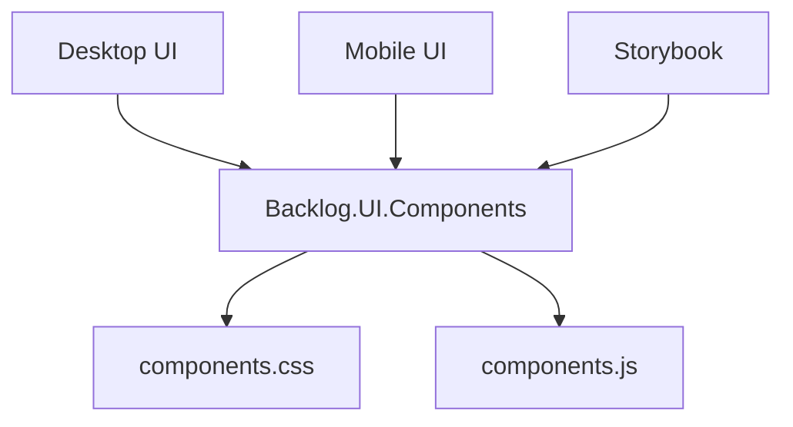

# The storybook's Archify artifact

One committed Archify artifact, served by `StorybookDiagramArtifacts` so the
*Diagrams* page can show `DiagramView`'s artifact mode — the Archify/Mermaid
switch, full screen, the out-of-date notice and the render offer — with no
application behind it.

`slice-flow.architecture.json` is the source; `slice-flow.architecture.html` is
generated from it and is committed only because generating it needs Node, which
building this solution does not otherwise require. Do not hand-edit the HTML —
regenerate it. The HTML is embedded in the storybook assembly (see the csproj);
the JSON is here so the artifact can be regenerated and so the fixture has a real
specification path to name.

## What it was authored from

The artifact is a re-authoring of this mermaid, held verbatim as
`StorybookDiagramArtifacts.ComponentMap`. `DiagramView` finds an artifact by the
hash of the normalized source, so the constant and this fence must stay identical
— a changed label is exactly what the **Artifact out of date** story shows.



## Regenerating

Archify is vendored under `tools/archify/` at a pinned revision and needs no
install; Node 18+ is enough. From that directory, with `$WW` pointing at the folder
this README is in:

```bash
cd tools/archify
node bin/archify.mjs deliver architecture $WW/slice-flow.architecture.json $WW/slice-flow.architecture.html --quality showcase --json
```

`deliver` validates before it writes and exits non-zero if it cannot. It is
expected to report 9 of 9 artifact checks with 0 errors and 0 warnings; anything
less means the specification regressed, not that the bar moved.

The specification's `meta` carries `"animation": "trace"`; Archify's default is
static, and a static artifact passes every check it has. `tools/diagrams/README.md`
has the full account. `ArchifyArtifactMotionTests` covers the knowledge-chapter
artifacts under `_archify/`; this folder sits outside the paths it scans, so the
`deliver` report above is the check.
